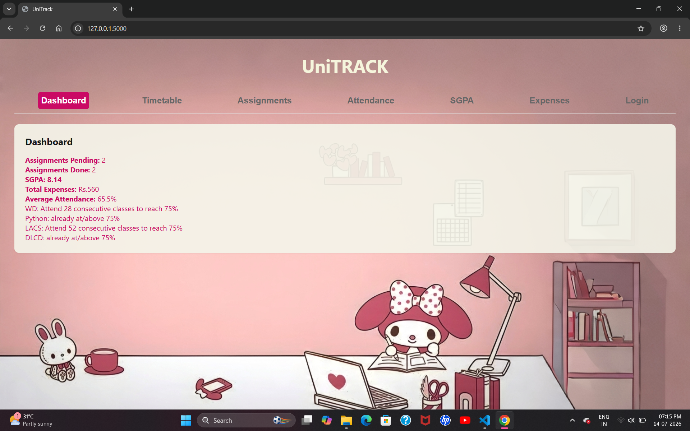
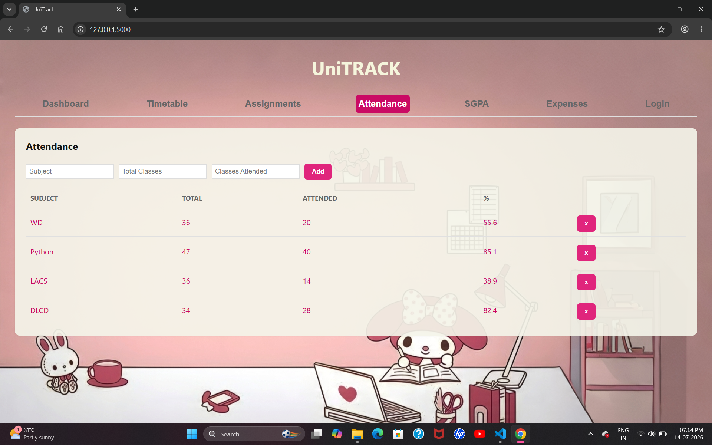
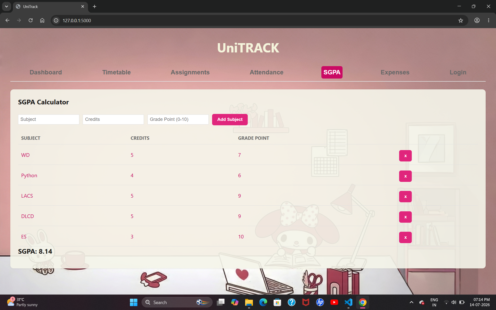

#UniTrack

Full-stack student productivity platform built using **Flask** and **SQLite**.
Unitrack helps students manage their academic and personal tasks in one place.

##Manage
- Timetable
- Assignments
- Expenses
- Attendance tracking & prediction
- SGPA calculator
- User authentication

#Features
- Login, Signup & Logout
- Multiple user support
- Attendance percentage calculation
- Attendance prediction (75% target tracking)
- Assignment management
- Expense tracking
- Timetable Management
- Dashboard overview
- Responsive design

#Tech Stack

##Frontend
- HTML
- CSS
- JavaScript

##Backend
- Flask

##Database
- SQLite

##Authentication
- Flask sessions
- Werkzeug password hashing

#Screenshots

##Dashboard

##Assignment tracking

##Attendance tracking

##SGPA calculator

#What I learned
- Flask REST APIS
- SQLite database design
- Authentication & sessions
- Async JavaScript
- Full-stack debugging

#Future improvements
- Notifications
- Due-date reminders
- Better analytics
